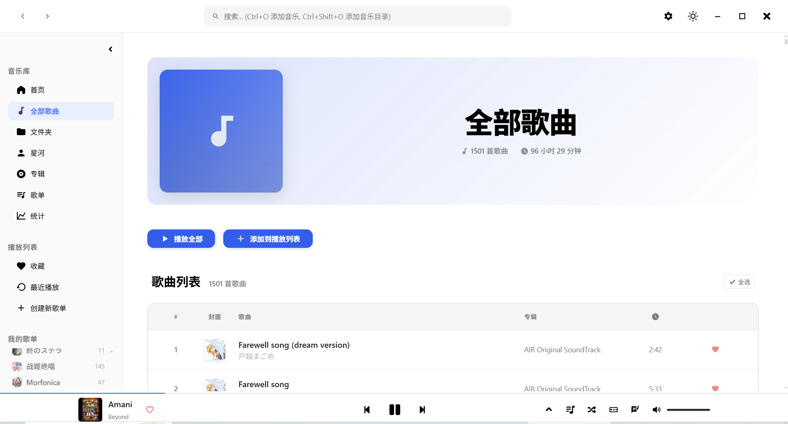
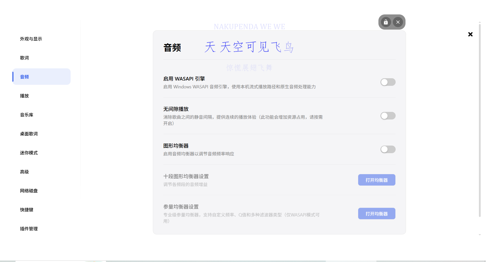
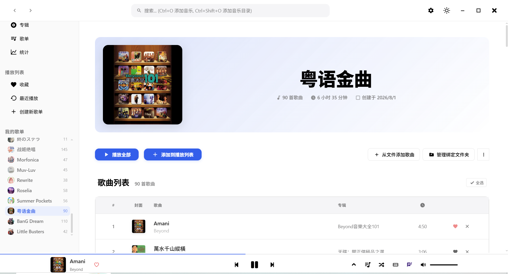
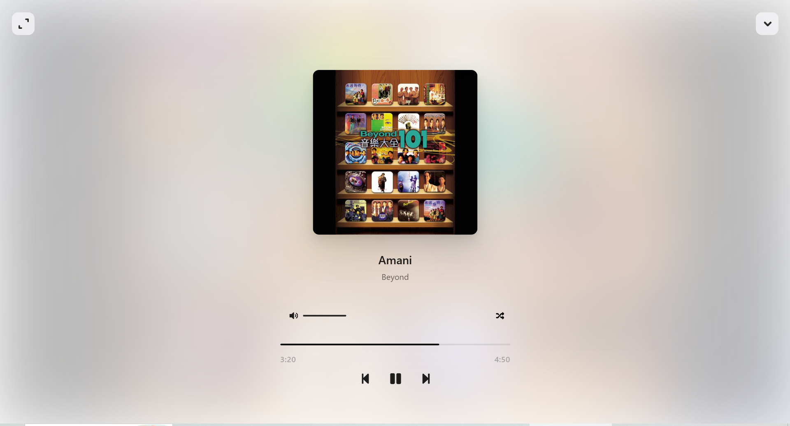
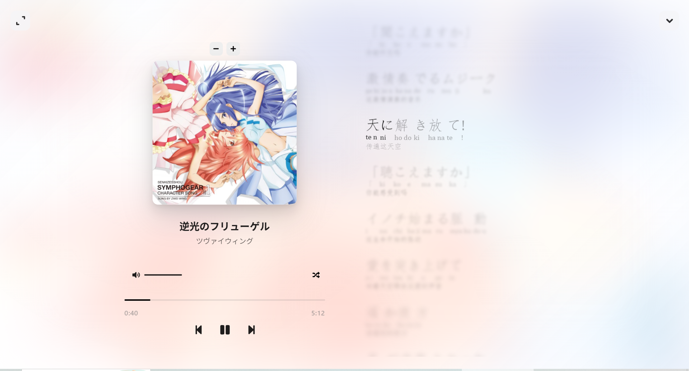

<br />
<p align="center">
  
  <h1 align="center" style="font-weight: 600">🎵 MusicBox</h1>
  <p align="center">
    高颜值、插件化、可深度定制的本地音乐播放器
    <br />
    <br />
    <a href="https://musicbox.asxe.vip/"><strong>🌐 官方网站</strong></a>&nbsp;&nbsp;|&nbsp;&nbsp;
    <a href="#-安装"><strong>📦下载安装</strong></a>&nbsp;&nbsp;|&nbsp;&nbsp;
    <a href="#-开发"><strong>🛠️开发指南</strong></a>&nbsp;&nbsp;|&nbsp;&nbsp;
    <a href="#-插件开发"><strong>🔧为MusicBox开发插件</strong></a>&nbsp;&nbsp;|&nbsp;&nbsp;
    <a href="#-相关截图"><strong>📌相关截图</strong></a>
    <br />
  </p>
</p>

[](https://deepwiki.com/asxez/MusicBox)
[](LICENSE)
[](#-安装)
[](https://electronjs.org/)
[](https://nodejs.org/)

---

## 📖 项目简介

- **MusicBox**是一款专注于本地音乐播放的 Electron 桌面应用，采用现代化的技术栈和精美的用户界面设计。
- 项目灵感来源于 [YesPlayMusic](https://github.com/qier222/YesPlayMusic) 的设计美学。

## ✨ 特性

- 💻️ 支持 Windows / macOS / Linux
- ✅ 支持flac, mp3, wav, ogg, m4a, aac, wma等多种音乐格式
- 🔧 强大的插件系统
- 🎶 支持 WASAPI 音频独占模式
- 📄 支持逐字歌词（使用 TTML 格式歌词）
- 🤏 支持迷你播放器
- 📔 支持在线获取歌曲封面和歌词
- ⌨️ 支持自定义局内/全局快捷键
- 🎈 浅色/深色主题切换
- 🎼 支持图形/参量均衡器，搭配专业级预设
- 📃 支持桌面显示歌词
- 📔 支持识别内嵌封面和内嵌歌词
- 👁️ 支持自由的页面显示开关
- 💾 支持挂载 SMB/WebDAV 等网络磁盘
- 🖋️ 支持编辑歌曲元数据
- ▶️ 支持无间隙播放，为连续的专辑歌曲提供更好的播放体验
- 🛠️ 更多特性开发中

## 📔 TODOS
- WASAPI 模式下的 Windows 媒体浮层同步
- 分离文本与代码，i18n 支持
- 支持更多来源的在线歌词，支持歌词翻译
- 完善上游的首页音乐可视化、专注模式等功能
- 更多的主题和外观选项

## 📃 文档
- [总体架构](docs/Architecture.md)：进程模型、IPC、主进程、渲染进程、音频、插件、安全边界
- [渲染进程架构](docs/RendererArchitecture.md)：重构后的 canonical 目录、依赖方向、兼容层和新增功能规则
- [开发指南](docs/Development.md)：环境准备、常用命令、检查项、打包和排障
- [插件系统指南](src/renderer/src/extensions/docs/PluginSystemGuide.md)：插件结构、manifest、激活事件和生命周期
- [Extension API](src/renderer/src/extensions/api/README.md)：播放器、音乐库、UI、存储、命令、快捷键等插件 API

## 📦 安装

### 预编译版本

前往 [Releases](https://github.com/zet-wu/MusicBox/releases) 页面下载适合你系统的安装包。

### 从源码构建

#### 环境要求

- Node.js >= 22
- Python >= 3.8（依赖必须安装在仓库根目录的 `.venv` 虚拟环境中）
- Rust toolchain with Cargo，推荐使用支持 Rust 2024 edition 的稳定版本；当前 Rust WASAPI 模块仅在 Windows 构建和使用

从源码构建 MusicBox，请按照以下步骤操作：

#### 1. 克隆仓库

```bash
git clone https://github.com/asxez/MusicBox.git
cd MusicBox
```

#### 2. 创建 Python 虚拟环境

Windows PowerShell：

```powershell
python -m venv .venv
.\.venv\Scripts\Activate.ps1
python -m pip install --upgrade pip
python -m pip install -r requirements.txt
```

macOS/Linux：

```bash
python3 -m venv .venv
source .venv/bin/activate
python -m pip install --upgrade pip
python -m pip install -r requirements.txt
```

后续开发和构建命令均应在已激活 `.venv` 的终端中执行。

#### 3. 安装 Node.js 和 Rust 相关依赖

```bash
npm install
npm run install:renderer
npm run install:rs
```

#### 4. 开发模式运行

Windows 可运行完整开发流程（包含 WASAPI 原生模块）：

```bash
npm run dev
```

当前 `npm run dev` 和 `npm run dev:main` 含有 Windows 专用步骤。macOS/Linux 开发时使用 Web Audio 回退路径：

```bash
npm run build:renderer
npm run build:ts
npx electron dist/main/main.js --expose-gc
```

#### 5. 构建应用

安装包在对应的目标操作系统上构建：

```bash
# Windows
npm run build:rs
npm run build:win

# macOS
npm run build:mac

# Linux
npm run build:linux
```

## 🛠️ 开发

### 项目架构

见[MusicBox 架构文档](Architecture.md)


## 🔧 插件开发

可在 **issue** 中提交你开发的插件，我会在此链接你的仓库😋

[MusicBox 插件文档](src/renderer/src/extensions/README.md)


### 可用插件列表

内置插件：主题增强插件

## 🤝 贡献

我们欢迎所有形式的贡献！无论是报告 bug、提出功能建议、提交代码，或者说提交你开发的插件！

注意：日志输出请务必以相关 emoji 图标开头！（日志过多，便于快速查看）

## 📄 许可证

本项目基于 [MIT License](LICENSE) 开源协议。

## 🙏 致谢

**以下排名不分先后**

- 所有为项目做出贡献的开发者们
- [AMLL TTML 歌词站](https://amlldb.bikonoo.com/) 提供的 TTML 歌词接口
- [锂 API](https://api.lrc.cx/) 提供的 LRC 歌词接口 

## 📌 相关截图









---

<p align="center">
  <strong>如果你喜欢这个项目，请给它一个 ⭐️</strong>
</p>
